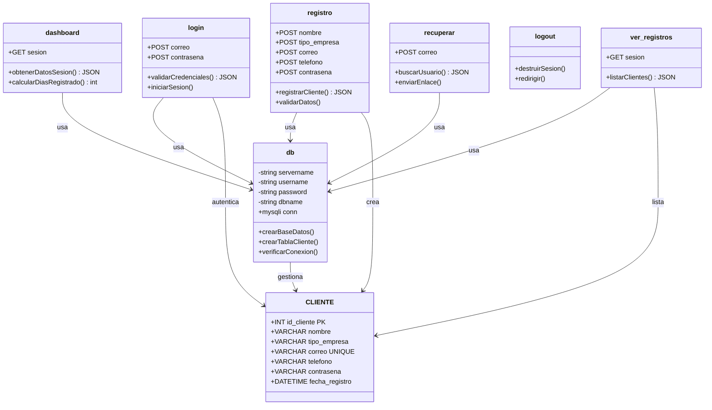
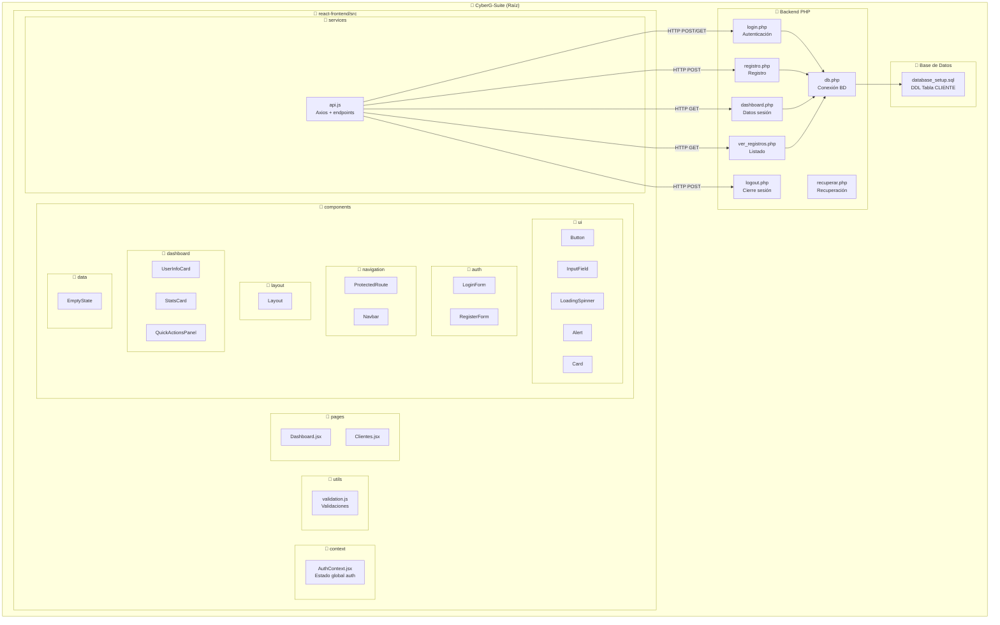
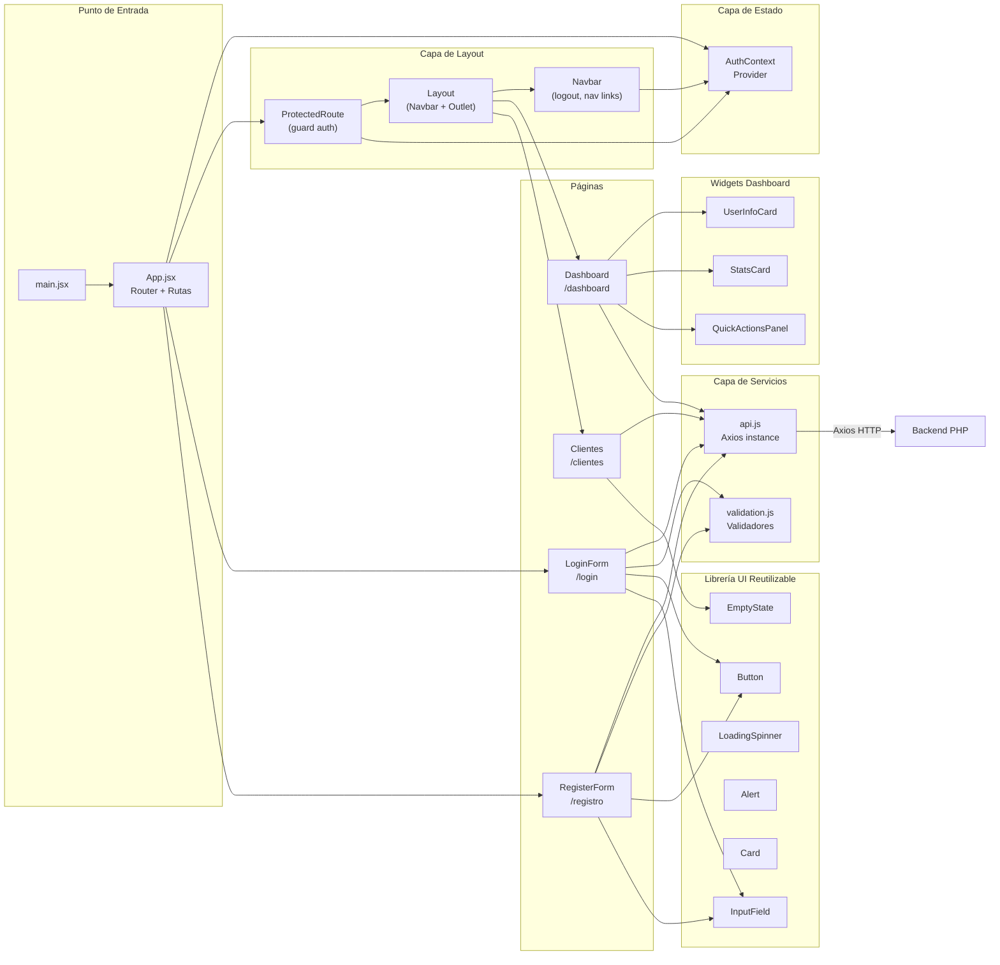
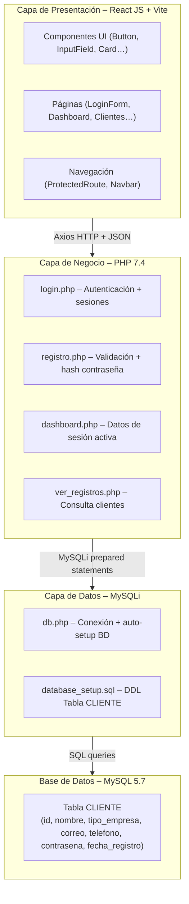

# Diagramas de Arquitectura – CyberG Suite

**Proyecto:** CyberG Suite | **Ficha:** 3070422 | **Aprendiz:** Cristian Ferney Castaño Torres  
**Evidencia:** GA8-220501096-AA1-EV01

---

## 1. Diagrama de Clases

---

## 2. Diagrama de Paquetes

---

## 3. Diagrama de Componentes

---

## 4. Capas de Arquitectura

---

*Diagramas generados con Mermaid – renderizados en GitHub automáticamente*  
*CyberG Suite – Ficha 3070422 – GA8-220501096-AA1-EV01*
