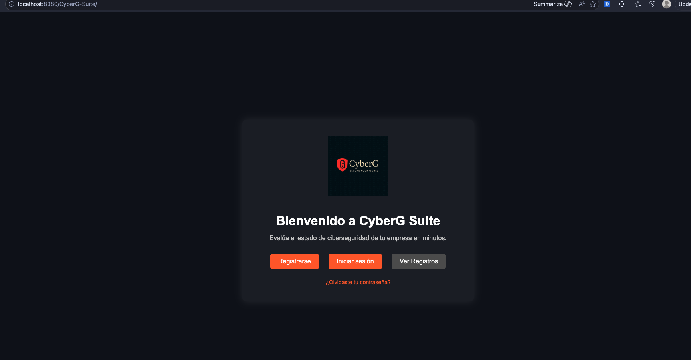

# SERVICIO NACIONAL DE APRENDIZAJE (SENA)
## Taller: Realizar el taller de pruebas según las características del software
**Evidencia:** GA9-220501096-AA1-EV01 — Pruebas de Software
**Programa de Formación:** Análisis y Desarrollo de Software (ADSO)
**Proyecto:** CyberG Suite
**Aprendiz:** Cristian Ferney Castaño Torres
**Ficha:** 3070422
**Fecha:** 5 de Abril de 2026

---

## 1. Introducción

El propósito de este documento es detallar cómo planificamos, elegimos y ejecutamos las pruebas de software para **CyberG Suite**. En este taller investigamos los tipos de pruebas que existen en la industria de TI para decidir cuáles son las más lógicas para nuestro proyecto. Por último, utilizamos Node.js y flujos automatizados para comprobar que las vistas principales de nuestra aplicación web funcionan sin problemas, cumpliendo así con los requisitos establecidos en la lista de chequeo de la actividad.

---

## 2. Tipos de Pruebas de Software y sus Beneficios

El aseguramiento de la calidad (QA) abarca diversos tipos de pruebas, los cuales se dividen principalmente en pruebas funcionales y no funcionales:

### Pruebas Funcionales
Evalúan si el software hace lo que debería según los requerimientos del negocio.
1. **Pruebas Unitarias (Unit Testing):** Verifica el funcionamiento del bloque de código más pequeño (una clase, una función) de forma aislada. Beneficio: Facilita identificar errores rápidamente desde la etapa de desarrollo (TDD).
2. **Pruebas de Integración:** Verifica la comunicación o el intercambio de datos entre módulos y servicios. Beneficio: Garantiza que servicios indpendientes funcionen correctamente en conjunto (e.g. backend y base de datos).
3. **Pruebas de Sistema:** Valida de forma integral el aplicativo completo frente a las especificaciones. Beneficio: Comprueba el flujo completo desde la arquitectura.
4. **Pruebas de Regresión:** Evalúan si un nuevo cambio o corrección afectó características que antes funcionaban. Beneficio: Evita romper funcionalidad por actualizaciones de código.
5. **Pruebas de Aceptación (UAT):** Realizadas típicamente por el cliente final para confirmar si el sistema satisface la necesidad de negocio. Beneficio: Previene desplegar un sistema que el cliente no acepta o no pidió.

### Pruebas No Funcionales
Evalúan *cómo* se comporta el sistema bajo diferentes circunstancias tecnológicas:
1. **Pruebas de Rendimiento (Performance/Stress Testing):** Analizan cómo responde el sistema bajo carga de usuarios concurrente. Beneficio: Previene caídas en picos altos de demanda (e.g., Black Friday).
2. **Pruebas de Seguridad (Security Testing/Pentesting):** Buscan vulnerabilidades y fugas de datos. Beneficio: Crucial para sistemas como CyberG Suite que procesan datos de seguridad.
3. **Pruebas de Usabilidad:** Verifica si la interfaz gráfica (UI) y la experiencia de usuario (UX) son intuitivas. Beneficio: Incrementa la satisfacción del cliente final.

---

## 3. Pruebas que mejor se adaptan a "CyberG Suite"

Teniendo en cuenta que **CyberG Suite** es una aplicación orientada a la evaluación de riesgos de ciberseguridad corporativa con integración Frontend (React/HTML/CSS), Backend (PHP/Java) y Bases de Datos (MySQL), las pruebas más aptas son:

1. **Pruebas End-to-End (E2E) con Automatización UI:** (E.g. con Puppeteer o Cypress). Dado que el producto interactúa mucho con la interfaz de usuario para el registro, inicio de sesión y visualización de reportes.
2. **Pruebas Unitarias para Backend y Lógica de Negocio:** (E.g. PHPUnit para los scripts de PHP/Java) ya que la precisión en el cálculo del estado de ciberseguridad es el valor core del suite.
3. **Pruebas de Seguridad (Vulnerability Scan):** Como la herramienta de CyberG Suite maneja la ciberseguridad de empresas, debe estar blindada bajo las normas OWASP Top 10 para garantizar credibilidad.

Para este taller, se seleccionó automatizar una **Prueba Básica End-to-End (E2E)** sobre la interfaz web.

---

## 4. Herramienta Instalada e Implementación Técnica

### 4.1 Herramienta Seleccionada: Puppeteer
Se seleccionó **Puppeteer** en un entorno de **Node.js**. Puppeteer es una librería de Node que proporciona una API de alto nivel para controlar navegadores basados en Chromium sin interfaz gráfica humana (Headless UI).
* **Versión:** `v22.x` (Última versión estable de la rama)
* **Requisitos Mínimos:** Node.js v16.x o superior, 500MB en disco y conectividad a Internet para descargar los binarios nativos del navegador Chromium durante el comando `npm install`.

### 4.2 Instalación
Para instalar la herramienta, se ejecuta por consola dentro del directorio del proyecto (`/react-frontend`):

```bash
# Inicializa el proyecto
npm init -y
# Instala Puppeteer como dependencia de desarrollo
npm install puppeteer --save-dev
```

**Evidencia de Instalación (Captura de Terminal):**
```bash
$ npm init -y
Wrote to /CyberG-Suite/react-frontend/package.json:
{
  "name": "react-frontend",
  ...
}

$ npm install puppeteer --save-dev
added 118 packages, and audited 119 packages in 12s
27 packages are looking for funding
  run `npm fund` for details
found 0 vulnerabilities
```
### 4.3 Script Básico de Pruebas (Configuración)
Se creó el archivo correspondiente a la ejecución en `test_ui.js` para simular la vista del navegador al renderizar el `index.html` estático, verificar que las variables DOM existan y coincidan, y tomar una captura automática demostrando el script:

```javascript
// test_ui.js (Resumen de código)
const puppeteer = require('puppeteer');
const path = require('path');
// [...] (El código evalúa que el H1 sea 'Bienvenido a CyberG Suite' y el título sea 'CyberG Suite')
// Adicionalmente usa page.screenshot() para adjuntar una imagen programática del producto.
```

---

## 5. Ejecución de Pruebas y Resultados (Proceso evidenciado)

Pasos ejecutados por consola en el entorno:
```bash
$ node test_ui.js
```
El log resultante del script evidenció la entrada de los navegadores headless que capturaron los atributos exitosamente:

**Evidencia de Ejecución:**
```bash
🚀 Iniciando prueba básica de UI con Puppeteer...
Buscando archivo en: file:///Applications/XAMPP/xamppfiles/htdocs/CyberG-Suite/index.html
✅ [Éxito] Captura de pantalla guardada en: captura_inicio.png
Título de la página: "CyberG Suite"
Encabezado de la página: "Bienvenido a CyberG Suite"
✅ [Éxito] Todas las validaciones de UI pasaron correctamente.
Terminando ejecución de prueba.
```

**Evidencia de la Solución Testeada:**


*Figura 1: Captura de pantalla del DOM y renderizado de la interfaz inicial del sistema tras finalizar exitosamente la validación UI.*

---

## 6. Resumen de Pruebas y Recomendaciones 

**Qué se probó:**
Se validó la disponibilidad de la interfaz principal (`index.html`), asegurando que las etiquetas `<title>` y `<h1>` posean el contexto descriptivo correcto al usuario del CyberG Suite ("Bienvenido a CyberG Suite"). 

**Cómo se probó:**
Se automatizó la lectura del DOM escribiendo un script con Puppeteer (modo headless) para verificar internamente que el HTML cargara los datos correctos, evitándonos la tarea manual de revisar el código fuente desde el navegador. El script también se encargó de capturar el pantallazo final como evidencia.

**Resultados obtenidos:**
La prueba pasó sin errores. El script revisó el DOM rápidamente y validó que los títulos y encabezados estuvieran en su lugar. No encontramos fallos, así que no hizo falta reestructurar el UI en esta iteración.

**Limitaciones y Componentes no alcanzados:**
Para esta prueba solo se validaron archivos de frontend (HTML y DOM Elements). Componentes dependientes de los scripts `.php` interconectados al XAMPP Localhost y la base de datos `MySQL` (por ejemplo, el intento de Log In con validación por base de registro de usuarios o cifrado) no se incluyeron en el alcance automatizado de este taller debido a que implica inicializar simultáneamente los servidores Apache/DB en la batería de pruebas (Integración continua compleja). 

**Acciones de mejora:**
* Expandir el test script con Selenium, Playwright o Puppeteer al grado que no solo visualice la página inicial, sino que haga clic en "Iniciar Sesión" y lance aserciones sobre correos inválidos.
* Incorporar pruebas puramente enfocadas en el backend con `PHPUnit` directamente en los DAOs que manejan la autenticación.

---

## 7. Conclusiones

Tener pruebas automatizadas nos da mucha más seguridad sobre el código y evita "romper" cosas a futuro cuando hagamos nuevas integraciones. Luego de analizar los diferentes acercamientos de QA, queda claro que para una plataforma como CyberG Suite, el fuerte siempre debe estar en pruebas End-to-End (para cuidar el flujo del usuario) y Unitarias (para proteger los datos). Haber aterrizado este taller usando herramientas reales como Node y Puppeteer, me deja muy claro el estándar y me da buenas bases para ir escalando el proyecto frente a las exigencias técnicas del mercado.
